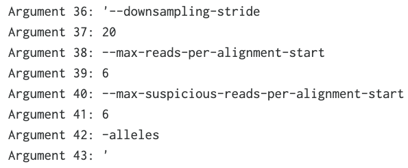

# Mutect2
This repository will detail the implementation of an applet on DNANexus that runs 50 samples per job using Mutect2.

## Tutorial
- Use 0_build_applet.sh, 1_batch_inputs.sh, 2_batch_script.sh, and 3_submission_script.sh in order to submit batch executions.
- Modify workflow_input.json with correct variables before running batch_script.py
- Important: "null.txt" - This is a dummy file that can have anything in it, such as "Dummy File". But, it must be named "null.txt". This file must be assigned to any file variable located in mutect_50_samples_orientation/dxapp.json (such as the "m2_extra_args_files" variable) if you do not want that parameter to be used in the analysis. You will need to assign the project ID and the file ID for "null.txt" to the appropriate file variables in the workflow_input.json file.

### Special Notes
Since the Splitintervals task is not being used - notes regarding the -L parameter from the Mutect2 command that is present in the M2 task:
- Instead of using the Splitintervals task and feeding it an interval list, we are instead feeding it the .bed file that would normally be fed into the Splitintervals task.

### Cloud Computing Optimization
- Always consider the minimum disk storage space, GB memory, and CPU you need for each job.
- Instance type - this is the most important - mem3_ssd1_v2_x2 is the cheapest per hour at 0.0132 euros, 2 CPU, 16 GB memory, and 75 GB storage.

## Batch Executions

### Best option: Batch Preparation for Large Sample Sets
- https://dnanexus.gitbook.io/uk-biobank-rap/science-corner/guide-to-analyzing-large-sample-sets
- Login to DNANexus
```
dx login
```

- Build the applet using 0_build_applet.sh
- Grab the number of samples you'd like using 1_batch_inputs.sh
- Prepare all of the dx run commands using batch_script.py (see 2_batch_script.sh for instructions)
- Check the first command
```
head -1 submission_command.txt
```
- Run the first command to debug
```
head -1 submission_command.txt | sh
```
- Launch remaining jobs - can use multiple terminals if desired.

### Limitations on Batch Executions:
- Hard limit of 500 concurrent workers per user. Extra jobs are placed in a job queue.

### Job Monitoring
- This shows a log of job execution in real-time.
- However, it is unreliable and has frequently not shown the full contents of the log file (the log file on DNANexus under the "Monitoring" tab is much more reliable).
```
dx watch <job_id>
```

## Optional Variables
- Making variables optional in Bash requires a lot more effort than in WDL. Therefore, "if, then" statements will be utilized sparingly as the need arises around the usage of certain variables.
- To be efficient, the bare-bones needed parameters that are necessary to meet our needs will be coded in first (based off the mutect2.wdl and a previous successful run in Terra).

## Issues
- Attempts at passing strings with spaces in them into a Docker image as a single argument result in issues.
- Example - mutect2_m2_extra_args: '--downsampling-stride 20 --max-reads-per-alignment-start 6 --max-suspicious-reads-per-alignment-start 6 -alleles'




## Resources:

- [Intro to Building Apps](https://documentation.dnanexus.com/developer/apps/intro-to-building-apps)
- [Running Apps and Applets](https://documentation.dnanexus.com/user/running-apps-and-workflows/running-apps-and-applets)
- [dxapp.json Metadata](https://documentation.dnanexus.com/developer/apps/app-metadata)
- [DNANexus Talk on Apps, Applets, and Workflows](https://www.youtube.com/watch?v=U8QZAGwnUm0)(28:53 - Limitations on Batch Executions)
